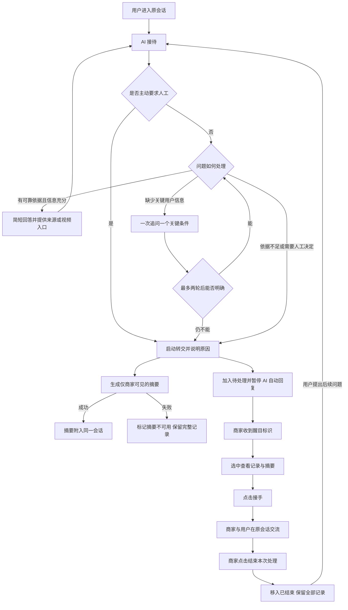

# 花窗伞 AI 客服 MVP｜简版产品需求文档

版本：v0.2 · 2026-10-08  
状态：方案评审稿；尚未开发、上线或验证效果。

## 1. 一分钟介绍

本项目源于花窗伞团购业务中的重复咨询。商家默认雨伞可以淋雨，但用户可能担心花窗印刷遇水受损；商品说明与用户顾虑之间存在信息差。MVP 以第二轮团购为业务范围，采用用户页与商家页两个网页入口：AI 根据已确认资料回答商品、购买与使用问题；缺少用户信息时追问，缺少可靠依据或涉及售后决定时转人工。用户、AI 和商家共享同一份聊天记录，商家查看内部摘要并接手回复，结束后由 AI 接待后续新问题。

项目要验证的是：在回答准确的前提下，能否帮助用户更方便地找到答案，并减少商家的重复解释和接手时的信息整理工作。

## 2. 背景与证据

| 内容 | 当前证据与边界 |
|---|---|
| 多个群重复出现“雨天能不能用” | 项目参与者回忆；没有频次统计 |
| 用户可能担心印刷遇水受损 | 参与者基于经历的解释；尚未通过用户访谈确认 |
| 晴雨可用、印刷防水 | 《二团开团公告》明确说明 |
| 自动／手动区别、材质问题 | 当前回忆不足以认定为高频需求 |
| 售后需要人工判断 | 用户确认钱款、换货、责任判断由人工处理 |

优先改善售前信息获取；售后承担材料提醒和人工交接。整理后的商品说明／FAQ 是效果比较基线。AI 是否带来额外价值，需要后续测试。

## 3. 用户、目标与范围

**购买者：** 获得商品与使用说明，需要时联系人工，不重复讲述问题。  
**商家：** 集中发现待处理会话，快速了解情况，在原会话回复并结束处理。

**第一版包含：** 商品与规则问答、款式解释与对比、使用视频占位入口、必要追问、主动／自动转人工、内部摘要、商家接手与回复、处理结束、历史记录保留、醒目的未读标识。

**暂不包含：** 个性化导购推荐、下单支付、真实订单／物流接口、微信群或微店接入、AI 审核售后视频、自动退款／换货／赔偿审批、多商家分配与复杂客服绩效管理。

演示采用二团历史业务，并明确显示“二团历史业务模拟”标识。2026-10-09 用户确认默认模拟日期为 2026-05-04，日期拟通过配置调整，时间相关回答使用模拟日期；配置与标识尚待实现。不得将历史预计收货日期表述为当前物流。访客身份、商家认证与持久化的一阶段实现见阶段说明。

## 4. 页面结构

### 用户页

- 完整聊天记录：每条消息明确区分用户、AI 助手、商家。
- 输入框、发送按钮、随时可用的“转人工”入口。
- 接待状态：AI 接待中／等待人工／人工接待中／本次处理已结束。
- 回答按需显示来源、商品说明和使用视频入口。
- 转交时显示原因和等待提示；商家内部摘要不向用户展示。
- 等待或人工接待期间仍可补充信息，内容进入原会话。

### 商家页

```text
┌────────────────┬──────────────────────────┬────────────────────┐
│ 会话列表       │ 完整聊天记录             │ 当前处理摘要       │
│                │                          │                    │
│ 待处理（上部） │ 用户 / AI / 商家身份标识 │ 转交原因           │
│ ● 未读会话     │ 转交、接手、结束提示     │ 用户诉求           │
│  当前选中高亮  │                          │ 已知情况           │
│                │                          │ 已尝试操作         │
│ 已结束（下部） │                          │ 材料情况           │
│  历史会话      │                          │                    │
│                │ 商家回复框               │ [接手] [结束处理]  │
└────────────────┴──────────────────────────┴────────────────────┘
```

仅有“待处理”“已结束”两个列表。“待处理”同时容纳尚未接手与人工接待中的会话，以状态标签区分。选中只表示查看；点击接手才开放回复。AI 独立接待的会话不作为待处理事项出现。

新转交和待处理会话的新消息触发醒目标识；查看后清除未读标识，不能因此移出待处理列表。结束处理才移入已结束列表。

## 5. 核心流程图



摘要可随转交生成，但摘要失败不得阻塞转交。无历史问题也可直接转交，摘要注明“用户主动请求人工，尚未描述问题”。

## 6. 状态与交接规则

| 当前状态 | 触发动作 | 结果 |
|---|---|---|
| AI 接待中 | 用户提问 | AI 回答、追问或转交 |
| AI 接待中 | 用户主动转人工／AI 判断需人工 | 等待人工，加入待处理，暂停 AI |
| 等待人工 | 用户补充 | 写入原记录；不创建重复事项，不触发 AI 回复 |
| 等待人工 | 商家选中 | 仅查看，状态不变 |
| 等待人工 | 商家点击接手 | 人工接待中，开放商家回复框 |
| 人工接待中 | 双方发消息 | 继续原会话，AI 不插话 |
| 人工接待中 | 商家结束处理 | 本次处理结束，移入已结束 |
| 已结束 | 用户再次提问 | AI 恢复接待；历史记录保留 |
| 恢复 AI 后 | 再次需要人工 | 原会话重新进入待处理；为本次问题生成新摘要 |

补充约束：同一会话不得重复加入待处理；转交后即使先前 AI 请求稍晚返回，也不能继续向用户发送自动回复。摘要应标明覆盖到哪条消息，后续补充直接显示在完整记录中，避免将旧摘要当作最新全部情况。

## 7. AI 回答与摘要要求

1. 有来源、信息充分：简短回答，提供可展开的依据。
2. 缺少型号等关键条件：结合上下文，一次追问一个条件；同一问题最多两轮，仍无法明确则转交。两轮为初始设计值，后续测试调整。
3. 资料缺失或冲突：不猜测。询问防晒指数或检测报告时，直接说明当前资料缺失、无法确认，不自动转人工；其他已标注需要商家核实的事项沿用转交规则，用户明确要求人工时立即转交。
4. 涉及退款、换货、赔偿、损坏责任、例外审批：提醒材料并转交，不作最终批准或拒绝。
5. 用户主动要求人工：立即转交，材料提醒不构成转交前置条件。
6. 语气自然、友好、简洁；不使用“这当然可以”等轻视顾虑的表达。

**内部摘要字段：** 转交原因、用户诉求、已知商品及问题情况、已尝试操作、材料已提供／缺失／未确认情况、对应消息依据。没有的信息明确写未提供；不编造订单号、材料或处理承诺。

**回答示例：** “可以正常在雨天使用。二团公告说明伞面印刷是防水的。”附公告来源。不扩大成任何条件下绝不掉色、抗风等级或未经检测的防晒指标。

## 8. 首批业务知识

### 商品

| 印刷类型 | 花窗位置 | 外侧文字颜色 | 开合方式 | 当前价格口径 |
|---|---|---|---|---|
| 单面 | 内侧 | 无 | 自动／手动 | 45 元 |
| 单面 | 外侧 | 无 | 自动／手动 | 45 元 |
| 双面 | 内侧 | 红色 | 自动／手动 | 56 元 |
| 双面 | 内侧 | 黄色 | 自动／手动 | 56 元 |

共 8 种组合，来自用户本次确认。用户确认二团沿用首轮价格；首轮文档为约价且提及开合方式可能影响价格，因此 45／56 元作为当前录入口径，不擅自添加差价，也不表述为已核实的逐 SKU 最终支付价格。

二团仅开晴雨伞，不售透明伞。伞布和防晒底布、伞骨不锈钢来自用户补充；具体材质规格及检测参数缺失。首轮资料不能覆盖二团款式确认。

### 使用、地址和售后

- 使用说明：按款式给演示视频入口；本版允许明确标记的占位，不显示可实际播放的假按钮。售后证据视频由人工审核。
- 地址修改：二团 2026-05-07 为最终截止，截止前在微店修改；截止后平台显示成功也不生效，特殊情况转人工。
- 对外售后期：开始发货后一个月；具体发货起算日未提供，不能计算某个申请是否超期。
- 内部宽限：书面结束后额外留一周，仅商家处理规则可见，不进入用户端回答知识。
- 售后材料：开箱视频、订单截图、瑕疵照片；视频缺失但有收货照片的情况可能人工接受，AI 不自动拒绝。
- 质量与操作原因不清：转人工，不因使用后出现故障就断定人为损坏。

知识分别记录适用轮次、主题、来源、确认状态和对外／内部可见性。内部宽限不进入用户可见的检索来源或摘要。

## 9. 验收与评估

### 功能验收：必须通过

| 编号 | 场景 | 通过条件 |
|---|---|---|
| A1 | 问雨天能否使用 | 根据二团资料准确回答，有出处，不增加性能承诺 |
| A2 | 问具体防晒指数或检测报告 | 直接说明当前没有可提供的检测资料、无法确认指标，不编造参数，也不自动转人工 |
| A3 | 款式不明确 | 先问关键条件，最多两轮后无法明确则转交 |
| A4 | 无历史直接转人工 | 成功进入待处理，无虚构摘要 |
| A5 | 有历史转人工 | 商家看到摘要及全部记录；用户仅看到原因与状态 |
| A6 | 摘要生成失败 | 仍进入待处理，有完整记录可接手 |
| A7 | 等待期间重复点击或补充 | 只有一个待处理事项，新消息有醒目标识，AI 不回复 |
| A8 | 商家选中与接手 | 选中仅查看，接手后可回复，用户在原会话收到商家消息 |
| A9 | 结束及再次咨询 | 记录保留，后续由 AI 接待；再次转交更新本次摘要 |
| A10 | 角色与内部内容 | 身份清楚；用户看不到内部摘要和宽限规则 |
| A11 | 视频入口 | 明确显示待补充，不假装已播放或已验证操作效果 |

### 首轮质量评估

准备约 30 条题，标注来自文档、回忆或构造；覆盖正常问答、缺少信息、知识缺失、跨轮次混淆和人工审批。约三分之一保留为开发时不用于反复调优的测试题。

- 回答正确率：正确且有依据的回答数／被评估回答数。
- 必须转人工识别率：正确转交数／标注为必须转交的案例数。
- 不必要转人工率：本可回答却被转交数／标注为可回答的案例数。
- 摘要质量：核对是否遗漏关键诉求、编造事实，以及人工需要修改的内容。
- 闭环完成：按 A4—A9 检查消息、状态和列表变化。

以上先记录实际结果，不预填达标数字。第一轮目标是 A1—A11 均通过，测试中无虚构参数或擅自承诺赔偿；这不代表真实环境零风险。后续与整理后的 FAQ 做同任务比较，观察正确完成、追问次数和用时。真实咨询下降、满意度提升、人工节省工时只能在真实试用后报告。

## 10. 开发前待落实项

不影响本次方案评审；不需要重新访谈历史用户。

| 项目 | 当前处理 |
|---|---|
| 使用视频链接 | 用户同意先占位 |
| 逐 SKU 最终价格 | 使用当前 45／56 元口径，开合差价不补造；上线报价前核实 |
| 具体发货起算日、模拟日期 | 默认模拟日期已确认 2026-05-04，拟通过配置调整；发货起算日仍未知，不计算个案售后是否过期或真实物流状态 |
| 用户／商家身份、聊天存储 | 开发前选定最小实现，确保会话隔离和跨页面同步 |
| 模型接入与成本 | 开发前明确服务与凭据；规则演示不得冒充真实模型能力 |
| 售后材料附件 | 已确定提醒与记录材料情况；上传和存储方式尚未确定，不能宣称已支持视频审核或附件接收 |

## 11. 本次评审结论与下一步

核心用户、范围、双页面布局、会话状态、交接规则已确定。本文件用于整体介绍与评审；下一步在用户明确同意开发后，将知识条目、页面细节和验收案例转成实现任务。
